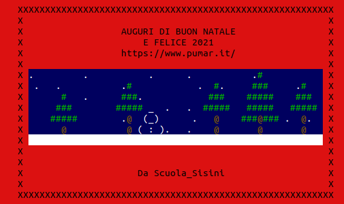

# Cartolina di Buon Natale
### Cartolina Musicale con Animazioni ASCII personalizzabile

_____________________________________________________________

                UN ESEGUIBILE DI AUGURI

Una cartolina di Natale personalizzabile per gli utenti Linux

@2020 Scuola_Sisini
https://pumar.it

francescomichelesisini@gmail.com
_____________________________________________________________

Puoi personalizzare il messaggio di auguri, l'animazione e la musica e invia l'eseguile o il codice a chi vuoi

**Offerto da**: [Sfidare gli algoritmi: 5 videogiochi in C su Linux](https://www.amazon.it/dp/1695109325)

ISTRUZIONI PER LA PERSONALIZZAZIONE:

Dal file [auguri_natale_2020.c](auguri_natale_2020.c) puoi modificare:

- il testo degli auguri
- l'animazione

mentre dal file [gingle_bell.c ](gingle_bell.c ) puoi modificare:

- la melodia di accompagnamento

ISTRUZIONI PER LA COMPILAZIONE:

apri un terminale (almeno 80 colonne e 40 righe)
- CTRL ALT T

Scarica [il sorgente](https://github.com/francescosisini/cartoline.git) con

- `git clone https://github.com/francescosisini/cartoline.git`

Vai nella directory del progetto:

- `cd cartoline`

Compila i sorgenti:
- `.\compila_gb`
- `.\compila_card`

ISTRUZIONI PER L'ESECUZIONE:

lancia:
      
- `./auguri_2020`

ISTRUZIONE PER LA TERMINAZIONE

L'animazione e la musica sono su due therad separati, per interrompere anzi tempo l'esecuzione, premere due volte CTRL C

Se non senti la musica, puoi installare la libreria openal
